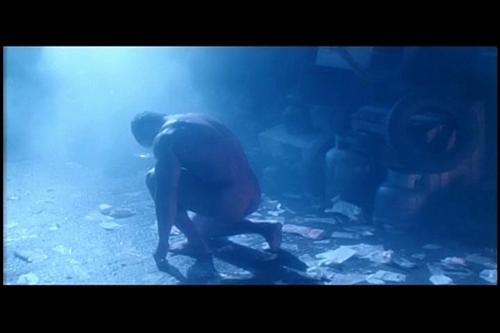

# C++的特点和程序实例 (大标题,一般就是小节标题)

## C++的产生和发展 (二级标题)

- item1
- item2


1. item1
2. item2

### (三级标题,如此类推)

#### 几点注意
- **图片:**

在pics里创建各章(c1,c2)图片目录,**注意图片命名**,要求不能以1.png,2.jpg这种,力求直观


- **代码:**
```cpp
#include <iostream>
using namespace std;
int main() {
     int day;
     cin >> day;
     switch (day) {
     case 0: cout << "Sunday" << endl; break;
     case 1: cout << "Monday" << endl; break;
     case 2: cout << "Tuesday" << endl; break;
     case 3: cout << "Wednesday" << endl; break;
     case 4: cout << "Thursday" << endl; break;
     case 5: cout << "Friday" << endl; break;
     case 6: cout << "Saturday" << endl; break;
     default:
        cout<<"Day out of range Sunday .. Saturday"<< endl;   break;
     }
     return 0;
}
```
- **讲义会有加粗,高亮的文字**, 我们对应用**加粗**就可以了

- 注意有些特殊符号可能会在markdown需要转义
