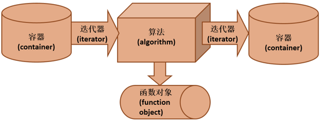
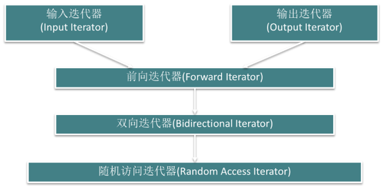
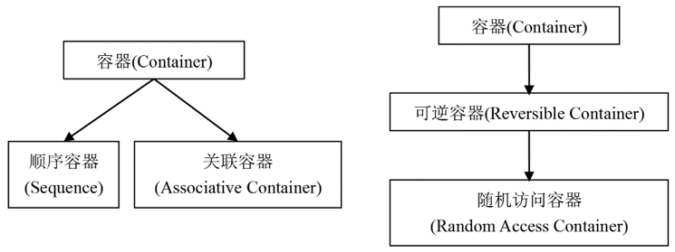
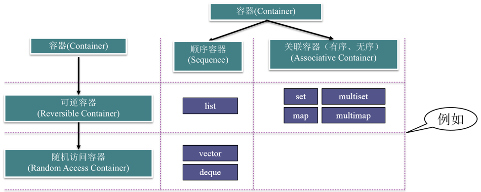
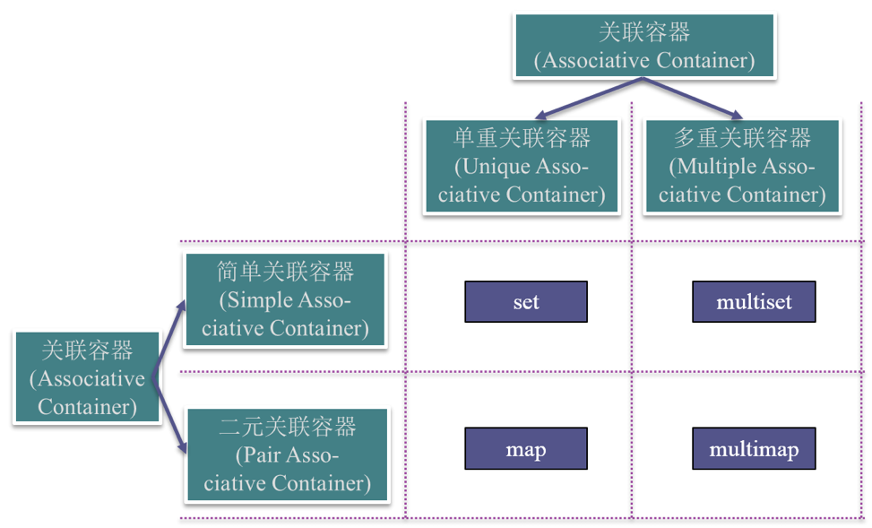
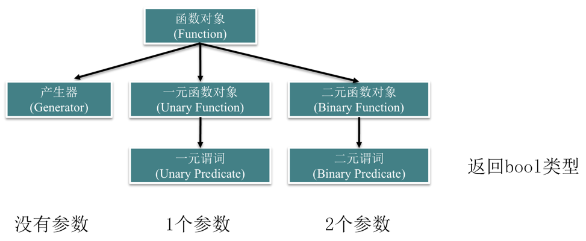

# 第十章 泛型程序设计与C++标准模板库

## 本章主要内容
- 泛型程序设计的概念
- 与标准模板库有关的概念和术语
- 迭代器
- 容器
- 函数对象
- 算法


## 泛型程序设计的基本概念
- 编写不依赖于具体数据类型的程序
- 将算法从特定的数据结构中抽象出来，成为通用的
- C++的模板为泛型程序设计奠定了关键的基础

### 术语：概念
- 用来界定具备一定功能的数据类型。例如：
  - 将“可以比大小的所有数据类型（有比较运算符）”这一概念记为```Comparable```
  - 将“具有公有的复制构造函数并可以用‘```=```’赋值的数据类型”这一概念记为```Assignable```
  - 将“可以比大小、具有公有的复制构造函数并可以用‘=’赋值的所有数据类型”这个概念记作```Sortable```。
- 对于两个不同的概念A和B，如果概念A所需求的所有功能也是概念B所需求的功能，那么就说概念B是概念A的子概念。例如：
  - ```Sortable```既是```Comparable```的子概念，也是```Assignable```的子概念

### 术语：模型
- 模型（model）：符合一个概念的数据类型称为该概念的模型，例如：
  - ```int```型是```Comparable```概念的模型。
  - 静态数组类型不是```Assignable```概念的模型（无法用“```=```”给整个静态数组赋值）

### 用概念做模板参数名
- 很多STL的实现代码就是使用概念来命名模板参数的。
- 为概念赋予一个名称，并使用该名称作为模板参数名。
- 例如
  - 表示```insertionSort```这样一个函数模板的原型：
  - ```template <class Sortable>```
  - ```void insertionSort(Sortable a[], int n);```


## STL简介
**标准模板库（Standard Template Library，简称STL）提供了一些非常常用的数据结构和算法。***

### STL简介
- 标准模板库（Standard Template Library，简称STL）定义了一套概念体系，为泛型程序设计提供了逻辑基础
- STL中的各个类模板、函数模板的参数都是用这个体系中的概念来规定的。
- 使用STL的模板时，类型参数既可以是C++标准库中已有的类型，也可以是自定义的类型——只要这些类型是所要求概念的模型。

### STL的基本组件
- 容器（container）
- 迭代器（iterator）
- 函数对象（function object）
- 算法（algorithms）

### STL的基本组件间的关系
- Iterators（迭代器）是算法和容器的桥梁。
  - 将迭代器作为算法的参数、通过迭代器来访问容器而不是把容器直接作为算法的参数。
- 将**函数对象**作为算法的参数而不是将函数所执行的运算作为算法的一部分。
- 使用STL中提供的或自定义的迭代器和函数对象，配合STL的算法，可以组合出各种各样的功能。



### STL的基本组件——容器（container）
- 容纳、包含一组元素的对象。
- 基本容器类模板	
  - 顺序容器
  - array（数组）、vector（向量）、deque（双端队列）、forward_list（单链表）、list（列表）
  - (有序)关联容器
  - set（集合）、multiset（多重集合）、map（映射）、multimap（多重映射）
  - 无序关联容器
  - unordered_set （无序集合）、unordered_multiset（无序多重集合）
  - unordered_map（无序映射）、unorder_multimap（无序多重映射）
- 容器适配器
  - stack（栈）、queue（队列）、priority_queue（优先队列）
- 使用容器，需要包含对应的头文件

### STL的基本组件——迭代器（iterator）
- 迭代器是泛化的指针，提供了顺序访问容器中每个元素的方法
- 提供了顺序访问容器中每个元素的方法；
- 可以使用“```++```”运算符来获得指向下一个元素的迭代器；
- 可以使用“```*```”运算符访问一个迭代器所指向的元素，如果元素类型是类或结构体，还可以使用“```->```”运算符直接访问该元素的一个成员；
- 有些迭代器还支持通过“```--```”运算符获得指向上一个元素的迭代器；
- 迭代器是泛化的指针：指针也具有同样的特性，因此指针本身就是一种迭代器；
- 使用独立于STL容器的迭代器，需要包含头文件<iterator>。

### STL的基本组件——函数对象（function object）
- 一个行为类似函数的对象，对它可以像调用函数一样调用。
- 函数对象是泛化的函数：任何普通的函数和任何重载了“```()```” 运算符的类的对象都可以作为函数对象使用
- 使用STL的函数对象，需要包含头文件<functional>

### STL的基本组件——算法（algorithms）
- STL包括70多个算法
  - 例如：排序算法，消除算法，计数算法，比较算法，变换算法，置换算法和容器管理等
- 可以广泛用于不同的对象和内置的数据类型。
- 使用STL的算法，需要包含头文件<algorithm>。
- 例10-1从标准输入读入几个整数，存入向量容器，输出它们的相反数

### 例10-1：STL程序实例
transform算法
- transform算法的一种实现：
``` cpp
template <class InputIterator, class OutputIterator, class UnaryFunction>
OutputIterator transform(InputIterator first, InputIterator last, OutputIterator result, UnaryFunction op) {
	for (;first != last; ++first, ++result)
		*result = op(*first);
	return result;
}
```
- transform算法顺序遍历```first```和```last```两个迭代器所指向的元素；
- 将每个元素的值作为函数对象```op```的参数；
- 将```op```的返回值通过迭代器```result```顺序输出；
- 遍历完成后```result```迭代器指向的是输出的最后一个元素的下一个位置，transform会将该迭代器返回


## 迭代器
- 迭代器是算法和容器的桥梁
  - 迭代器用作访问容器中的元素
  - 算法不直接操作容器中的数据，而是通过迭代器间接操作
- 算法和容器独立
  - 增加新的算法，无需影响容器的实现
  - 增加新的容器，原有的算法也能适用

### 输入流迭代器和输出流迭代器
- 输入流迭代器
	```istream_iterator<T>```
  - 以输入流（如```cin```）为参数构造
  - 可用```*(p++)```获得下一个输入的元素
- 输出流迭代器
	```ostream_iterator<T>```
  - 构造时需要提供输出流（如```cout```）
  - 可用```(*p++) = x```将```x```输出到输出流
- 二者都属于适配器
  - 适配器是用来为已有对象提供新的接口的对象
  - 输入流适配器和输出流适配器为流对象提供了迭代器的接口

### 例10-2从标准输入读入几个实数，分别将它们的平方输出
``` cpp
//10_2.cpp
#include <iterator>
#include <iostream>
#include <algorithm>
using namespace std;
 
//求平方的函数
double square(double x) {
	return x * x;
}
int main() {
	//从标准输入读入若干个实数，分别将它们的平方输出
    transform(istream_iterator<double>(cin), istream_iterator<double>(),
		ostream_iterator<double>(cout, "\t"), square);
    cout << endl;
    return 0;
}
```

### 迭代器的分类


### 迭代器支持的操作
- 迭代器是泛化的指针，提供了类似指针的操作（诸如```++```、```*```、```->```运算符）
- 输入迭代器
  - 可以用来从序列中读取数据，如输入流迭代器
- 输出迭代器
  - 允许向序列中写入数据，如输出流迭代器
- 前向迭代器
  - 既是输入迭代器又是输出迭代器，并且可以对序列进行单向的遍历
- 双向迭代器
与前向迭代器相似，但是在两个方向上都可以对数据遍历
- 随机访问迭代器
  - 也是双向迭代器，但能够在序列中的任意两个位置之间进行跳转，如指针、使用vector的```begin()```、```end()```函数得到的迭代器

### 迭代器的区间
- 两个迭代器表示一个区间：```[p1, p2)```
- STL算法常以迭代器的区间作为输入，传递输入数据
- 合法的区间
  - ```p1```经过```n```次```(n > 0)```自增```(++)```操作后满足```p1 == p2```
- 区间包含```p1```，但不包含```p2```

### 例10-3 综合运用几种迭代器的示例
程序涉及到输入迭代器、输出迭代器、随机访问迭代器这三个迭代器概念，并且以前两个概念为基础编写了一个通用算法。
``` cpp
//10_3.cpp
#include <algorithm>
#include <iterator>
#include <vector>
#include <iostream>
using namespace std;
 
//将来自输入迭代器的n个T类型的数值排序，将结果通过输出迭代器result输出
template <class T, class InputIterator, class OutputIterator>
void mySort(InputIterator first, InputIterator last, OutputIterator result) {
	//通过输入迭代器将输入数据存入向量容器s中
	vector<T> s;
	for (;first != last; ++first)
		s.push_back(*first);
	//对s进行排序，sort函数的参数必须是随机访问迭代器
    sort(s.begin(), s.end());  
	copy(s.begin(), s.end(), result);	//将s序列通过输出迭代器输出
}

int main() {
	//将s数组的内容排序后输出
	double a[5] = { 1.2, 2.4, 0.8, 3.3, 3.2 };
	mySort<double>(a, a + 5, ostream_iterator<double>(cout, " "));
	cout << endl;
	//从标准输入读入若干个整数，将排序后的结果输出
	mySort<int>(istream_iterator<int>(cin), istream_iterator<int>(), ostream_iterator<int>(cout, " "));
	cout << endl;
	return 0;
}
```
运行结果：
``` cpp
0.8 1.2 2.4 3.2 3.3
2 -4 5 8 -1 3 6 -5
-5 -4 -1 2 3 5 6 8
```

### 迭代器的辅助函数
- ```advance(p, n)```
  - 对```p```执行```n```次自增操作
- ```distance(first, last)```
  - 计算两个迭代器```first```和```last```的距离，即对```first```执行多少次“```++```”操作后能够使得```first == last```


## 容器的基本功能与分类
- 容器类是容纳、包含一组元素或元素集合的对象。
- 基于容器中元素的组织方式：顺序容器、关联容器
- 按照与容器所关联的迭代器类型划分：可逆容器随机访问容器

### 容器的基本功能与分类
- 容器	
  - 顺序容器
    - array（数组）、vector（向量）、deque（双端队列）、forward_list（单链表）、list（列表）
  - (有序)关联容器
    - set（集合）、multiset（多重集合）、map（映射）、multimap（多重映射）
  - 无序关联容器
    - unordered_set（无序集合）、unordered_multiset（无序多重集合）
    - unordered_map（无序映射）、unorder_multimap（无序多重映射）

### 容器的分类



### 容器的通用功能
- 容器的通用功能
  - 用默认构造函数构造空容器
  - 支持关系运算符：```==```、```!=```、```<```、```<=```、```>```、```>=```
  - ```begin()```、```end()```：获得容器首、尾迭代器
  - ```clear()```：将容器清空
  - ```empty()```：判断容器是否为空
  - ```size()```：得到容器元素个数
  - ```s1.swap(s2)```：将```s1```和```s2```两容器内容交换
- 相关数据类型（```S```表示容器类型）
  - ```S::iterator```：指向容器元素的迭代器类型
  - ```S::const_iterator```：常迭代器类型

### 对可逆容器的访问
- STL为每个可逆容器都提供了逆向迭代器，逆向迭代器可以通过下面的成员函数得到：
  - ```rbegin()``` ：指向容器尾的逆向迭代器
  - ```rend()```：指向容器首的逆向迭代器
- 逆向迭代器的类型名的表示方式如下：
  - ```S::reverse_iterator```：逆向迭代器类型
  - ```S::const_reverse_iterator```：逆向常迭代器类型

### 随机访问容器
- 随机访问容器支持对容器的元素进行随机访问
  - ```s[n]```：获得容器```s```的第```n```个元素


## 顺序容器的基本功能
### 顺序容器
- 向量（vector）
- 双端队列（deque）
- 列表（list）
- 单向链表（forward_list）
- 数组（array）
- 元素线性排列，可以随时在指定位置插入元素和删除元素。
- 必须符合Assignable这一概念（即具有公有的拷贝构造函数并可以用“```=```”赋值）。
- array对象的大小固定，forward_list有特殊的添加和删除操作。

#### 注：
- 向量、双端队、列表和单向链表在逻辑上可看作是一个长度可扩展的数组。


### 顺序容器的接口（不包含单向链表（forward_list）和数组（array））
- 构造函数
- 赋值函数
  - ```assign```
- 插入函数
  - ```insert```， ```push_front```（只对list和deque），```push_back```，```emplace```，```emplace_front```
- 删除函数
  - ```erase```，```clear```，```pop_front```（只对list和deque），```pop_back```，```emplace_back```
- 首尾元素的直接访问
  - ```front```，```back```
- 改变大小
  - ```resize```

### 例10-4 顺序容器的基本操作
``` cpp
//10_4.cpp
#include <iostream>
#include <list>
#include <deque>

//输出指定的顺序容器的元素
template <class T>
void printContainer(const char* msg, const T& s) {
	cout << msg << ": ";
	copy(s.begin(), s.end(), ostream_iterator<int>(cout, " "));
	cout << endl;
}
 
int main() {
	//从标准输入读入10个整数，将它们分别从s的头部加入
	deque<int> s;
	for (int i = 0; i < 10; i++) {
		int x;
		cin >> x;
		s.push_front(x);
	}
	printContainer("deque at first", s);
	//用s容器的内容的逆序构造列表容器l
	list<int> l(s.rbegin(), s.rend());
	printContainer("list at first", l);
```
### 例10-4 顺序容器的基本操作
``` cpp
	//将列表容器l的每相邻两个元素顺序颠倒
	list<int>::iterator iter = l.begin();
	while (iter != l.end()) {
		int v = *iter;	
		iter = l.erase(iter);
		l.insert(++iter, v);
	}
	printContainer("list at last", l);
	//用列表容器l的内容给s赋值，将s输出
	s.assign(l.begin(), l.end());
	printContainer("deque at last", s);
	return 0;
}
```
- 运行结果如下： 
``` cpp
   0 9 8 6 4 3 2 1 5 4
   deque at first: 4 5 1 2 3 4 6 8 9 0
   list at first: 0 9 8 6 4 3 2 1 5 4
   list at last: 9 0 6 8 3 4 1 2 4 5
   deque at last: 9 0 6 8 3 4 1 2 4 5
```


## 顺序容器的特性
- 顺序容器：向量、双端队列、列表、单向链表、数组

### 向量（Vector）
- 特点
  - 一个可以扩展的动态数组
  - 随机访问、在尾部插入或删除元素快
  - 在中间或头部插入或删除元素慢
- 向量的容量
  - 容量```(capacity)```：实际分配空间的大小
  - ```s.capacity()```：返回当前容量
  - ```s.reserve(n)```：若容量小于```n```，则对```s```进行扩展，使其容量至少为```n```

### 双端队列（deque）
- 特点
  - 在两端插入或删除元素快
  - 在中间插入或删除元素慢
  - 随机访问较快，但比向量容器慢

### 例10-5 奇偶排序
先按照从大到小顺序输出奇数，再按照从小到大顺序输出偶数。
``` cpp
// 头部分省略
int main() {
    istream_iterator<int> i1(cin), i2;	//建立一对输入流迭代器
    vector<int> s1(i1, i2);	//通过输入流迭代器从标准输入流中输入数据
    sort(s1.begin(), s1.end());	//将输入的整数排序
    deque<int> s2;
    //以下循环遍历s1
    for (vector<int>::iterator iter = s1.begin(); iter != s1.end(); ++iter) 
    {
         if (*iter % 2 == 0)	//偶数放到s2尾部
             s2.push_back(*iter);
         else		//奇数放到s2首部
             s2.push_front(*iter);
    }
    //将s2的结果输出
    copy(s2.begin(), s2.end(), ostream_iterator<int>(cout, " "));
    cout << endl;
    return 0;
}
```

### 列表(list)
- 特点
  - 在任意位置插入和删除元素都很快
  - 不支持随机访问
- 接合(splice)操作
  - ```s1.splice(p, s2, q1, q2)```：将```s2```中```[q1, q2)```移动到```s1```中```p```所指向元素之前
``` cpp
// 头部分省略
int main() {
	string names1[] = { "Alice", "Helen", "Lucy", "Susan" };
	string names2[] = { "Bob", "David", "Levin", "Mike" };
	//用names1数组的内容构造列表s1
    list<string> s1(names1, names1 + 4); 
	//用names2数组的内容构造列表s2
    list<string> s2(names2, names2 + 4); 
 
	//将s1的第一个元素放到s2的最后
    s2.splice(s2.end(), s1, s1.begin());
    list<string>::iterator iter1 = s1.begin(); //iter1指向s1首
    advance(iter1, 2); //iter1前进2个元素，它将指向s1第3个元素
    list<string>::iterator iter2 = s2.begin();  //iter2指向s2首
    ++iter2; //iter2前进1个元素，它将指向s2第2个元素
    list<string>::iterator iter3 = iter2; //用iter2初始化iter3
    advance(iter3, 2); //iter3前进2个元素，它将指向s2第4个元素
    //将[iter2, iter3)范围内的结点接到s1中iter1指向的结点前
    s1.splice(iter1, s2, iter2, iter3); 
 
    //分别将s1和s2输出
    copy(s1.begin(), s1.end(), ostream_iterator<string>(cout, " "));
    cout << endl;
    copy(s2.begin(), s2.end(), ostream_iterator<string>(cout, " "));
    cout << endl;
    return 0;
}
```

### 单向链表（forward_list）
- 单向链表每个结点只有指向下个结点的指针，没有简单的方法来获取一个结点的前驱；
- 未定义```insert```、```emplace```和```erase```操作，而定义了```insert_after```、```emplace_after```和```erase_after```操作，其参数与```list```的```insert```、```emplace```和```erase```相同，但并不是插入或删除迭代器```p1```所指的元素，而是对```p1```所指元素之后的结点进行操作；
- 不支持```size```操作。

### 数组（array）
- array是对内置数组的封装，提供了更安全，更方便的使用数组的方式
- array的对象的大小是固定的，定义时除了需要指定元素类型，还需要指定容器大小。
- 不能动态地改变容器大小

### 顺序容器的比较
- STL所提供的顺序容器各有所长也各有所短，我们在编写程序时应当根据我们对容器所需要执行的操作来决定选择哪一种容器。
  - 如果需要执行大量的随机访问操作，而且当扩展容器时只需要向容器尾部加入新的元素，就应当选择向量容器vector；
  - 如果需要少量的随机访问操作，需要在容器两端插入或删除元素，则应当选择双端队列容器deque；
  - 如果不需要对容器进行随机访问，但是需要在中间位置插入或者删除元素，就应当选择列表容器list或forward_list；
  - 如果需要数组，array相对于内置数组类型而言，是一种更安全、更容易使用的数组类型。


## 顺序容器的插入迭代器与适配器
### 顺序容器的插入迭代器
- 用于向容器头部、尾部或中间指定位置插入元素的迭代器
- 包括前插迭代器（front_inserter）、后插迭代器（back_insrter）和任意位置插入迭代器（inserter）
- 例：
``` cpp
list<int> s;
back_inserter iter(s);
*(iter++) = 5; //通过iter把5插入s末尾
```
### 顺序容器的适配器
- 以顺序容器为基础构建一些常用数据结构，是对顺序容器的封装
  - 栈(stack)：最先压入的元素最后被弹出
  - 队列(queue)：最先压入的元素最先被弹出
  - 优先级队列(priority_queue)：最“大”的元素最先被弹出

### 栈和队列模板
- 栈模板
``` cpp
template <class T, class Sequence = deque<T> > class stack;
```
- 队列模板
``` cpp
template <class T, class FrontInsertionSequence = deque<T> > class queue;
```
- 栈可以用任何一种顺序容器作为基础容器，而队列只允许用前插顺序容器（双端队列或列表）

### 栈和队列共同支持的操作
- ```s1 op s2```   ```op```可以是```==```、```!=```、```<```、```<=```、```>```、```>=```之一，它会对两个容器适配器之间的元素按字典序进行比较
- ```s.size()```	返回```s```的元素个数
- ```s.empty()```   返回```s```是否为空
- ```s.push(t)```	   将元素```t```压入到```s```中
- ```s.pop()```   将一个元素从```s```中弹出，对于栈来说，每次弹出的是最后被压入的元素，而对于队列，每次被弹出的是最先被压入的元素
- 不支持迭代器，因为它们不允许对任意元素进行访问

### 栈和队列不同的操作
- 栈的操作
  - ```s.top()```	返回栈顶元素的引用
- 队列操作
  - ```s.front()```	获得队头元素的引用
  - ```s.back()```	获得队尾元素的引用

### 例10-7 利用栈反向输出单词
``` cpp
//10_7.cpp， 省略头部分
int main() {
	stack<char> s;
	string str;
	cin >> str;	//从键盘输入一个字符串
	//将字符串的每个元素顺序压入栈中
	for (string::iterator iter = str.begin(); iter != str.end(); ++iter)
		s.push(*iter);
	//将栈中的元素顺序弹出并输出
	while (!s.empty()) {
		cout << s.top();
		s.pop();
	}
	cout << endl;
	return 0;
}
```
运行结果如下：
``` cpp
congratulations
snoitalutargnoc
```
### 优先级队列
- 优先级队列也像栈和队列一样支持元素的压入和弹出，但元素弹出的顺序与元素的大小有关，每次弹出的总是容器中最“大”的一个元素。
``` cpp
template <class T, class Sequence = vector<T> > class priority_queue;
```
- 优先级队列的基础容器必须是支持随机访问的顺序容器。
- 支持栈和队列的```size```、```empty```、```push```、```pop```几个成员函数，用法与栈和队列相同。
- 优先级队列并不支持比较操作。
- 与栈类似，优先级队列提供一个```top```函数，可以获得下一个即将被弹出元素（即最“大”的元素）的引用。

### 例10-8 细胞分裂模拟
一种细胞在诞生（即上次分裂）后会在500到2000秒内分裂为两个细胞，每个细胞又按照同样的规律继续分裂。
``` cpp
// 10.8.cpp, 头部分省略
const int SPLIT_TIME_MIN = 500;    //细胞分裂最短时间
const int SPLIT_TIME_MAX = 2000;  //细胞分裂最长时间
 
class Cell;
priority_queue<Cell> cellQueue;
 
class Cell {	//细胞类
private:
	static int count;	//细胞总数
	int id;		//当前细胞编号
	int time;	//细胞分裂时间
public:
	Cell(int birth) : id(count++) {	//birth为细胞诞生时间
		//初始化，确定细胞分裂时间
		time = birth + (rand() % (SPLIT_TIME_MAX - SPLIT_TIME_MIN))+ SPLIT_TIME_MIN;
	}
	int getId() const { return id; }		//得到细胞编号
	int getSplitTime() const { return time; }	//得到细胞分裂时间
	bool operator < (const Cell& s) const      //定义“<”
    { return time > s.time; }
	void split() {	//细胞分裂
	    Cell child1(time), child2(time);	//建立两个子细胞
	    cout << time << "s: Cell #" << id << " splits to #"
		<< child1.getId() << " and #" << child2.getId() << endl;
	    cellQueue.push(child1);	//将第一个子细胞压入优先级队列
	    cellQueue.push(child2);	//将第二个子细胞压入优先级队列
	}
};
int Cell::count = 0;
int main() {
	srand(static_cast<unsigned>(time(0)));
	int t;	//模拟时间长度
	cout << "Simulation time: ";
	cin >> t;
	cellQueue.push(Cell(0));	//将第一个细胞压入优先级队列
	while (cellQueue.top().getSplitTime() <= t) {
		cellQueue.top().split();	//模拟下一个细胞的分裂
		cellQueue.pop();	//将刚刚分裂的细胞弹出
	}
	return 0;
}
```
- 运行结果如下：
``` cpp
Simulation time: 5000
971s: Cell #0 splits to #1 and #2
1719s: Cell #1 splits to #3 and #4
1956s: Cell #2 splits to #5 and #6
2845s: Cell #6 splits to #7 and #8
3551s: Cell #3 splits to #9 and #10
3640s: Cell #4 splits to #11 and #12
3919s: Cell #5 splits to #13 and #14
4162s: Cell #10 splits to #15 and #16
4197s: Cell #8 splits to #17 and #18
4317s: Cell #7 splits to #19 and #20
4686s: Cell #13 splits to #21 and #22
4809s: Cell #12 splits to #23 and #24
4818s: Cell #17 splits to #25 and #26
```


## 关联容器分类和的基本功能
### 关联容器的特点和接口
- 关联容器的特点
  - 每个关联容器都有一个键(key)
  - 可以根据键高效地查找元素
- 接口
  - 插入：```insert```
  - 删除：```erase```
  - 查找：```find```
  - 定界：```lower_bound```、```upper_bound```、```equal_range```
  - 计数：```count```

### 关联容器概念图


### 四种关联容器
- 单重关联容器(set和map)
  - 键值是唯一的，一个键值只能对应一个元素
- 多重关联容器(multiset和multimap)
  - 键值是不唯一的，一个键值可以对应多个元素
- 简单关联容器(set和ultiset
  - 容器只有一个类型参数，如```set<K>```、```multiset<K>```，表示键类型
  - 容器的元素就是键本身
- 二元关联容器(map和multimap)
  - 容器有两个类型参数，如```map<K,V>```、```multimap<K,V>```，分别表示键和附加数据的类型
  - 容器的元素类型是```pair<K,V>```，即由键类型和元素类型复合而成的二元组

### 无序关联容器
- C++11新标准中定义了4个无序关联容器
  - unordered_set、unordered_map、unordered_multiset、unordered_multimap
- 不是使用比较运算符来组织元素的，而是通过一个哈希函数和键类型的==运算符。
- 提供了与有序容器相同的操作
- 可以直接定义关键字是内置类型的无序容器。
- 不能直接定义关键字类型为自定义类的无序容器，如果需要，必须提供我们自己的```hash```模板。


## 集合（set）
集合用来存储一组无重复的元素。由于集合的元素本身是有序的，可以高效地查找指定元素，也可以方便地得到指定大小范围的元素在容器中所处的区间。

### 例10-9  
输入一串实数，将重复的去掉，取最大和最小者的中值，分别输出小于等于此中值和大于等于此中值的实数
``` cpp
//10_9.cpp
#include <set>
#include <iterator>
#include <utility>
#include <iostream>
using namespace std;

int main() {
	set<double> s;
	while (true) {
	    double v;
	    cin >> v;
	    if (v == 0) break;	//输入0表示结束
	    //尝试将v插入
       pair<set<double>::iterator,bool> r=s.insert(v); 
	    if (!r.second)	//如果v已存在，输出提示信息
	       cout << v << " is duplicated" << endl;
	}
  //得到第一个元素的迭代器
	set<double>::iterator iter1=s.begin();
	//得到末尾的迭代器
	set<double>::iterator iter2=s.end();	
  //得到最小和最大元素的中值	
	double medium=(*iter1 + *(--iter2)) / 2;	
	//输出小于或等于中值的元素
	cout<< "<= medium: "
	copy(s.begin(), s.upper_bound(medium), ostream_iterator<double>(cout, " "));
	cout << endl;
	//输出大于或等于中值的元素
	cout << ">= medium: ";
	copy(s.lower_bound(medium), s.end(), ostream_iterator<double>(cout, " "));
	cout << endl;
	return 0;
}
```
运行结果如下：
``` cpp
  1 2.5 5 3.5 5 7 9 2.5 0
  5 is duplicated
  2.5 is duplicated
  <= medium: 1 2.5 3.5 5
  >= medium: 5 7 9
```


## 映射（map）
- 映射与集合同属于单重关联容器，它们的主要区别在于，集合的元素类型是键本身，而映射的元素类型是由键和附加数据所构成的二元组。
- 在集合中按照键查找一个元素时，一般只是用来确定这个元素是否存在，而在映射中按照键查找一个元素时，除了能确定它的存在性外，还可以得到相应的附加数据。

### 例10-10 
有五门课程，每门都有相应学分，从中选择三门，输出学分总和
``` cpp
//10_10.cpp
#include <iostream>
#include <map>
#include <string>
#include <utility>
using namespace std;
int main() {
	map<string, int> courses;
	//将课程信息插入courses映射中
	courses.insert(make_pair("CSAPP", 3));
	courses.insert(make_pair("C++", 2));
	courses.insert(make_pair("CSARCH", 4));
	courses.insert(make_pair("COMPILER", 4));
	courses.insert(make_pair("OS", 5));
	int n = 3;		//剩下的可选次数
	int sum = 0;	//学分总和
	while (n > 0) {
		string name;
		cin >> name;	//输入课程名称
		map<string, int>::iterator iter = courses.find(name);//查找课程
		if (iter == courses.end()) {	//判断是否找到
			cout << name << " is not available" << endl;
		} else {
			sum += iter->second;	//累加学分
			courses.erase(iter);	//将刚选过的课程从映射中删除
			n--;
		}
	}
	cout << "Total credit: " << sum << endl;	//输出总学分
	return 0;
}
```
运行结果如下：
``` cpp
C++
COMPILER
C++
C++ is not available
CSAPP
Total credit: 9
```

### 例10-11
统计一句话中每个字母出现的次数
``` cpp
// 10_11.cpp
#include <iostream>
#include <map>
#include <cctype>
using namespace std;
int main() {
	map<char, int> s;	//用来存储字母出现次数的映射
	char c;		//存储输入字符
	do {
	  cin >> c;	//输入下一个字符
	  if (isalpha(c)){ //判断是否是字母
          c = tolower(c); //将字母转换为小写
          s[c]++;	   //将该字母的出现频率加1
      }
	} while (c != '.'); //碰到“.”则结束输入
	//输出每个字母出现次数
	for (map<char, int>::iterator iter = s.begin(); iter != s.end(); ++iter)
		cout << iter->first << " " << iter->second << "  ";
	cout << endl;
	return 0;
}
```


## 多重集合（multiset）与多重映射（multimap）
- 多重集合是允许有重复元素的集合，多重映射是允许一个键对应多个附加数据的映射。
- 多重集合与集合、多重映射与映射的用法差不多，只在几个成员函数上有细微差异，其差异主要表现在去除了键必须唯一的限制。

### 例10-12 上课时间查询
``` cpp
//10_12.cpp
#include <iostream>
#include <map>
#include <utility>
#include <string>
using namespace std;
int main() {
	multimap<string, string> courses;
	typedef multimap<string, string>::iterator CourseIter;
 
	//将课程上课时间插入courses映射中
	courses.insert(make_pair("C++", "2-6"));
	courses.insert(make_pair("COMPILER", "3-1"));
	courses.insert(make_pair("COMPILER", "5-2"));
	courses.insert(make_pair("OS", "1-2"));
	courses.insert(make_pair("OS", "4-1"));
	courses.insert(make_pair("OS", "5-5"));
	//输入一个课程名，直到找到该课程为止，记下每周上课次数
	string name;
	int count;
	do {
		cin >> name;
		count = courses.count(name);
		if (count == 0)
		  cout << "Cannot find this course!" << endl;
	} while (count == 0);
	//输出每周上课次数和上课时间
	cout << count << " lesson(s) per week: ";
	pair<CourseIter, CourseIter> range = courses.equal_range(name);
	for (CourseIter iter = range.first; iter != range.second; ++iter)
		cout << iter->second << " ";
	cout << endl;
	
	return 0;
}
```
运行结果如下：
``` cpp
JAVA
Cannot find this course!
OS
3 lesson(s) per week: 1-2 4-1 5-5
```


## 函数对象
- 一个行为类似函数的对象
- 可以没有参数，也可以带有若干参数
- 其功能是获取一个值，或者改变操作的状态。
- 例
  - 普通函数就是函数对象
  - 重载了“```()```”运算符的类的实例是函数对象

### 函数对象概念图


### 例10-13、例10-14：
- 使用两种方式定义表示乘法的函数对象
  - 通过定义普通函数（例10-13）
  - 通过重载类的“```()```”运算符（例10-14）
用到以下算法：
``` cpp
template<class InputIterator, class Type, class BinaryFunction>
Type accumulate(InputIterator first, InputIterator last, Type val, BinaryFunction binaryOp);
```
  - 对```[first, last)```区间内的数据进行累“```加```”，```binaryOp```为用二元函数对象表示的“```加```”运算符，```val```为累“```加```”的初值

### 例10-13
``` cpp
#include <iostream>   
#include <numeric> //包含数值算法头文件
using namespace std;

//定义一个普通函数
int mult(int x, int y) { return x * y; };	

int main() {
	int a[] = { 1, 2, 3, 4, 5 };
	const int N = sizeof(a) / sizeof(int);
	cout << "The result by multipling all elements in a is "
		<< accumulate(a, a + N, 1, mult)
		<< endl;
	return 0;
}
```

### 例10-14
``` cpp
//10_14.cpp
#include <iostream>
#include <numeric> //包含数值算法头文件
using namespace std;
class MultClass{  //定义MultClass类
public:
  //重载操作符operator()
	int operator() (int x, int y) const { return x * y; }	
};
int main() {
	int a[] = { 1, 2, 3, 4, 5 };
	const int N = sizeof(a) / sizeof(int);
	cout << "The result by multipling all elements in a is "
		<< accumulate(a, a + N, 1, MultClass()) //将类multclass传递给通用算法
		<< endl;
	return 0;
}
```

### STL提供的函数对象
- 用于算术运算的函数对象：
  - 一元函数对象(一个参数) ：```negate```
  - 二元函数对象(两个参数) ：```plus```、```minus```、```multiplies```、```divides```、```modulus```
- 用于关系运算、逻辑运算的函数对象(要求返回值为```bool```)
  - 一元谓词(一个参数)：```logical_not```
  - 二元谓词(两个参数)：```equal_to```、```not_equal_to```、```greater```、```less```、```greater_equal```、```less_equal```、```logical_and```、```logical_or```

### 例10-15 利用STL标准函数对象
``` cpp
//10_15.cpp
#include <iostream>   
#include <numeric>   //包含数值算法头文件
#include <functional>  //包含标准函数对象头文件
using namespace std;	
int main() {
	int a[] = { 1, 2, 3, 4, 5 };
	const int N = sizeof(a) / sizeof(int);
	cout << "The result by multipling all elements in A is “
            << accumulate(a, a + N, 1, multiplies<int>())
		 << endl; //将标准函数对象传递给通用算法
	return 0;
}
```

### 例10-16利用STL中的二元谓词函数对象
``` cpp
// 10_16.cpp
#include <functional>
#include<iostream>
#include<vector>
#include<algorithm>
using namespace std;

int main() {
	int intArr[] = { 30, 90, 10, 40, 70, 50, 20, 80 };
	const int N = sizeof(intArr) / sizeof(int);
	vector<int> a(intArr, intArr + N);
 	cout << "before sorting:" << endl;
	copy(a.begin(),a.end(),ostream_iterator<int>(cout,"\t"));
	cout << endl;
 
	sort(a.begin(), a.end(), greater<int>());
 
	cout << "after sorting:" << endl;
	copy(a.begin(),a.end(),ostream_iterator<int>(cout,"\t"));
	cout << endl;
	return 0;
}
```


## 函数适配器
- 绑定适配器：```bind1st```、```bind2nd```
  - 将```n```元函数对象的指定参数绑定为一个常数，得到```n-1```元函数对象
- 组合适配器：```not1```、```not2```
  - 将指定谓词的结果取反
- 函数指针适配器：```ptr_fun```
  - 将一般函数指针转换为函数对象，使之能够作为其它函数适配器的输入。
  - 在进行参数绑定或其他转换的时候，通常需要函数对象的类型信息，例如```bind1st```和```bind2nd```要求函数对象必须继承于```binary_function```类型。但如果传入的是函数指针形式的函数对象，则无法获得函数对象的类型信息。
- 成员函数适配器：```ptr_fun```、```ptr_fun_ref```
  - 对成员函数指针使用，把n元成员函数适配为```n + 1```元函数对象，该函数对象的第一个参数为调用该成员函数时的目的对象
  - 也就是需要将“```object->method()```”转为“```method(object)```”形式。将“```object->method(arg1)```”转为二元函数“```method(object, arg1)```”。

### 绑定适配器
- ```binder2nd```的实例构造通常比较冗长，```bind2nd```函数用于辅助构造```binder2nd```，产生它的一个实例。
- ```binder1st```和```bind1st```，将一个具体值绑定到二元函数的第一个参数。

### 例10-17：函数适配器实例——找到数组中第一个大于40的元素
``` cpp
//10_17.cpp
#include <functional>
#include<iostream>
#include<vector>
#include<algorithm>
using namespace std;
 
int main() {
	int intArr[] = { 30, 90, 10, 40, 70, 50, 20, 80 };
	const int N = sizeof(intArr) / sizeof(int);
	vector<int> a(intArr, intArr + N);
	vector<int>::iterator p = find_if(a.begin(), a.end(), bind2nd(greater<int>(), 40));
	if (p == a.end())
		cout << "no element greater than 40" << endl;
	else
		cout << "first element greater than 40 is: " << *p << endl;
	return 0;
}
```
#### 注：
find_if算法在STL中的原型声明为：
```cpp
template<class InputIterator, class UnaryPredicate>
InputIterator find_if(InputIterator first, InputIterator last, UnaryPredicate pred);
```
它的功能是查找数组```[first, last)```区间中第一个```pred(x)```为真的元素。

### 组合适配器
- 对于一般的逻辑运算，有时可能还需要对结果求一次逻辑反。
- ```unary_negate和binary_negate```实现了这一适配功能。STL还提供了```not1```和```not2```辅助生成相应的函数对象实例，分别用于一元谓词和二元谓词的逻辑取反。

### 例10-18 ptr_fun、not1和not2产生函数适配器实例
``` cpp
// 10_18.cpp
#include <functional>
#include<iostream>
#include<vector>
#include<algorithm>
using namespace std;

bool g(int x, int y) {
	return x > y;
}
 
int main() {
	int intArr[] = { 30, 90, 10, 40, 70, 50, 20, 80 };
	const int N = sizeof(intArr) / sizeof(int);
	vector<int> a(intArr, intArr + N);
	vector<int>::iterator p;
	p = find_if(a.begin(), a.end(), bind2nd(ptr_fun(g), 40));
	if (p == a.end())
		cout << "no element greater than 40" << endl;
	else
		cout << "first element greater than 40 is: " << *p << endl;
	p = find_if(a.begin(), a.end(), not1(bind2nd(greater<int>(), 15)));
	if (p == a.end())
	    cout << "no element is not greater than 15" << endl;
	else
	    cout << "first element that is not greater than 15 is: " << *p << endl;
 
	p = find_if(a.begin(), a.end(), bind2nd(not2(greater<int>()), 15));
	if (p == a.end())
	    cout << "no element is not greater than 15" << endl;
	else
		cout << "first element that is not greater than 15 is: " << *p << endl;
	return 0;
}
```

### 例10-19 成员函数适配器实例
``` cpp
//10_19.cpp
#include <functional>
#include <iostream>
#include <vector>
#include <algorithm>
using namespace std;
 
struct Car {
	int id;
	Car(int id) { this->id = id; }
	void display() const { cout << "car " << id << endl; }
};
 
int main() {
	vector<Car *> pcars;
	vector<Car> cars;
	for (int i = 0; i < 5; i++)
		pcars.push_back(new Car(i));
	for (int i = 5; i < 10; i++)
		cars.push_back(Car(i));
	cout << "elements in pcars: " << endl;
	for_each(pcars.begin(), pcars.end(), std::mem_fun(&Car::display));
	cout << endl;
 
	cout << "elements in cars: " << endl;
	for_each(cars.begin(), cars.end(), std::mem_fun_ref(&Car::display));
	cout << endl;
 
	for (size_t i = 0; i < pcars.size(); ++i)
		delete pcars[i];
 
	return 0;
}
```

## 算法
### STL算法特点
- STL算法本身是一种函数模版
  - 通过迭代器获得输入数据
  - 通过函数对象对数据进行处理
  - 通过迭代器将结果输出
- STL算法是通用的，独立于具体的数据类型、容器类型

### STL算法分类
- 不可变序列算法
- 可变序列算法
- 排序和搜索算法
- 数值算法

### 不可变序列算法
- 不直接修改所操作的容器内容的算法
- 用于查找指定元素、比较两个序列是否相等、对元素进行计数等
- 例：
``` cpp
template<class InputIterator, class UnaryPredicate>
InputIterator find_if(InputIterator first, InputIterator last, UnaryPredicate pred);
```
查找```[first, last)```区间内```pred(x)```为真的首个元素

### 可变序列算法
- 可以修改它们所操作的容器对象
- 包括对序列进行复制、删除、替换、倒序、旋转、交换、分割、去重、填充、洗牌的算法及生成一个序列的算法
- 例：
``` cpp
template<class ForwardIterator, class T>
InputIterator find_if(ForwardIterator first, ForwardIterator last, const T& x);
```
将```[first, last)```区间内的元素全部改写为```x```。

### 排序和搜索算法
- 对序列进行排序
- 对两有序序列进行合并
- 对有序序列进行搜索
- 有序序列的集合操作
- 堆算法
- 例：
``` cpp
template <class RandomAccessIterator , class UnaryPredicate>
void sort(RandomAccessIterator first, RandomAccessIterator last, UnaryPredicate comp);
```
以函数对象```comp```为“```<```”，对 ```[first, last)```区间内的数据进行排序

### 数值算法
- 求序列中元素的“```和```”、部分“```和```”、相邻元素的“```差```”或两序列的内积
- 求“``````和”的“```+```”、求“差”的“```-```”以及求内积的“```+```”和“```·```”都可由函数对象指定
- 例：
  - ```template<class InputIterator, class OutputIterator, class BinaryFunction>```
  - ```OutputIterator partial_sum(InputIterator first, InputIterator last, OutputIterator result, BinaryFunction op);```
  - 对```[first, last)```内的元素求部分“```和```”（所谓部分“```和```”，是一个长度与输入序列相同的序列，其第```n```项为输入序列前```n```个元素的“和”），以函数对象```op```为“```+```”运算符，结果通过```result```输出，返回的迭代器指向输出序列最后一个元素的下一个元素

### 算法应用举例
- 例10-20——例10-23演示了几类算法的应用。
- 详见教材第10章


## 小结
- 本章主要内容
  - 泛型程序设计的概念
  - 与标准模板库有关的概念和术语
  - 迭代器
  - 容器
  - 函数对象
  - 算法
- 本章学习目标
  - 初步了解泛型程序设计的概念
  - 学会C++标准模板库（STL）的使用方法
